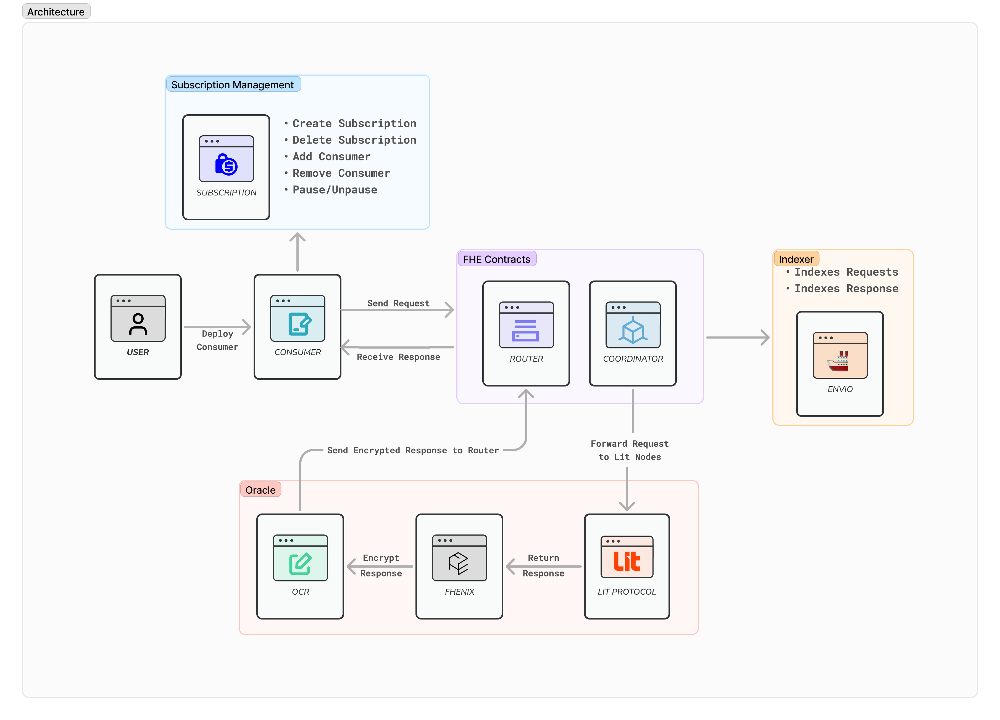

<p align="center">

</p>

FHE Oracle is a fully homomorphic encryption-powered data oracle on Fhenix blockchain. Computes or fetches data using Lit Protocol actions and is indexed using Envio.

Users can query any off-chain datasource, compute inside a Lit Action, execute transactions, sign messages or perform anything inside a Lit Action and get the result back in a fully homomorphic encrypted form.

## Architecture 🏗️



## How it works 🛠️

The Architecture is divided in three parts:

1. FHE Oracle Smart Contracts
2. Lit Action backed Oracle Service
3. Envio Indexer

---

### FHE Oracle Smart Contracts

Most of the contracts are inspired from Chainlink Functions Architecture where a user can create a `Consumer` Contract where they send requests and receive responses.

Oracles are Deployed and Verified on Fhenix Helium Testnet:

```bash
Router="0xbd533524e6f709AE55Bc7686C3e416D6870D1259"
Coordinator="0x1EA3bce6a8a08d8c08859Fe720024f98FeB11C4E"
Consumer="0x394403eE9b3b5e25D492Ad2FD4cc0836D8e75B52"
```

Router: https://explorer.helium.fhenix.zone/address/0xbd533524e6f709AE55Bc7686C3e416D6870D1259
Coordinator: https://explorer.helium.fhenix.zone/address/0x1EA3bce6a8a08d8c08859Fe720024f98FeB11C4E
Consumer: https://explorer.helium.fhenix.zone/address/0x394403eE9b3b5e25D492Ad2FD4cc0836D8e75B52

Before using the Oracle, the user needs to register their `Consumer` contract with the Oracle by creating a `Subscription` and adding the `Consumer` contract address for the Subscription.

While creating a request a user can pass the following parameters:

- `Source`: The source of the data. It can be a Lit Action IPFS CID or inline code to execute.
- `Public Arguments`: The public arguments to pass to the Lit Action.
- `Private Arguments`: The private arguments to pass to the Lit Action (will be encrypted using Lit Network and only decrypted inside the Lit Action).
- `Callback Gas Limit`: The gas limit for the callback transaction.

Once the Request is created, it is sent to the `Router` Contract. Then Router contract forwards the request to the `Coordinator` contract. The Oracle Service listens for the `Coordinator` contract events and fetches the request data.

---

### Lit Action backed Oracle Service

Once the event is received, the Oracle Service fetches the request data and executes the Lit Action. The Lit Action can be a simple computation or a complex off-chain data fetch. Private Parameters are decrypted inside the Lit Action and used to perform the computation.

Once the Action is Executed the result is encrypted using `Fhenix Blockchain Network Key` and then sent to `Off-Chain Reporting (OCR)` Contract. This is where the transmitter can batch and send multiple responses back to the `Coordinator` contract. The batch is signed using the Transmitter PK and sent to the Coordinator Contract.

The Coordinator Contract verifies the signature and then sends the response back to the `Consumer` contract via `Router`.

---

### Envio Indexer

Events are indexed using the Envio Indexer. The Indexer listens for the `Coordinator` contract events mainly `RequestSent` and `RequestFulfilled` and indexes the data. The data is then available for querying using the `FHE Oracle Frontend`.

This Indexed Data can be used by the Request Fulfillers/Transmitters to fetch the data and send the response back to the `Coordinator` contract.

## Demo Video 🎥

## Screenshots 📸

<table>
  <tr>
    <td valign="top" width="50%">
      <br>
      
    </td>
    <td valign="top" width="50%">
      <br>
      
    </td>
  </tr>
</table>

<table>
  <tr>
    <td valign="top" width="50%">
      <br>
            
    </td>
    <td valign="top" width="50%">
      <br>
            
    </td>
  </tr>
</table>

<table>
  <tr>
    <td valign="top" width="50%">
      <br>
            
    </td>
    <td valign="top" width="50%">
      <br>
            
    </td>
  </tr>
</table>

## 🧑🏼‍💻 Tech Stack

- **Frontend**: Next.js, Tailwind CSS, `@shadcn/ui`, `fhenixjs`, Lit Protocol
- **Smart Contracts**: Solidity, Hardhat `@fhenixprotocol/contracts`
- **Indexer**: `Envio HyperIndexer`
- **Integration**: `wagmi`, `web3modal`

## ❓ FAQs

<details>
<summary>
What is Fully Homomorphic Encryption (FHE)?
</summary>
<br />
FHE is a type of encryption that allows for computations to be performed directly on encrypted data without decrypting it first. This ensures that data remains private and secure throughout the entire process.

</details>
<br />
<details>
<summary>
What types of data can FHE Oracle handle?
</summary>
<br />
FHE Oracle can handle any type of data as they are executed inside a Lit Action. This means that you can fetch or compute over any data source, including APIs, databases, and more.
</details>
<br />
<details>
<summary>
How does Envio improve data access efficiency?
</summary>
<br />
Envio provides a powerful indexing mechanism that allows for efficient and scalable data access. This means that you ca get access to historic data quickly and easily.
</details>
<br />
<details>
<summary>
Is FHE Oracle compatible with other blockchains?
</summary>
<br />
No, FHE Oracle is only supported on Fhenix Network. However, it is possible use it with Cross-Chain Bridges to interact with other blockchains.
</details>
<br />
<details>
<summary>
How are secrets and arguments handled during data requests?
</summary>
<br />
Users make requests to FHE Oracle, they can include secrets or arguments along with their request. These secrets are encrypted and only decryptable by the oracle handlers. This ensures that sensitive data remains private and secure throughout the entire process
</details>
<br />
<details>
<summary>
What capabilities does Lit Protocol provide for FHE Oracle?
</summary>
<br />
Lit Protocol enables FHE Oracle to perform a variety of actions such as Executing blockchain transactions within Lit actions, Signing messages, Fetching data from various sources, Performing computations on encrypted data, And more
</details>

## Get Started 🚀

The following repository is a turborepo and divided into the following:

- **apps/www** - The web application built using NextJS.
- **packages/oracle** - FHE Oracle Smart Contracts.
- **packages/indexer** - The Envio Indexer

First install the dependencies by running the following:

```bash
pnpm install
```

Then fill in the Environment variables in `apps/www/.env.local`

```bash
NEXT_PUBLIC_WALLETCONNECT_ID="example_walletconnect_id"
PRIVATE_KEY="example_transmitter_pk"
NEXT_PUBLIC_LOCALFHENIX_ROUTER_ADDRESS="local_fhenix_router_address"
NEXT_PUBLIC_LOCALFHENIX_COORDINATOR_ADDRESS="local_fhenix_coordinator_address"
NEXT_PUBLIC_LOCALFHENIX_CONSUMER_ADDRESS="local_fhenix_consumer_address"
NEXT_PUBLIC_FHENIX_HELIUM_ROUTER_ADDRESS="0xbd533524e6f709AE55Bc7686C3e416D6870D1259"
NEXT_PUBLIC_FHENIX_HELIUM_COORDINATOR_ADDRESS="0x1EA3bce6a8a08d8c08859Fe720024f98FeB11C4E"
NEXT_PUBLIC_FHENIX_HELIUM_CONSUMER_ADDRESS="0x394403eE9b3b5e25D492Ad2FD4cc0836D8e75B52"
NEXT_PUBLIC_LOCAL_HASURA_GRAPHQL_URL="https://indexer.bigdevenergy.link/4b0d0de/v1/graphql"
NEXT_PUBLIC_HELIUM_HASURA_GRAPHQL_URL="https://indexer.bigdevenergy.link/4b0d0de/v1/graphql"
```

Then run the following command to start the application:

```bash
pnpm dev
```

To run the Smart Contracts, navigate to the `packages/oracle` directory and fill in the `.env` file:

```bash
PRIVATE_KEY_OWNER="private_key_owner"
PRIVATE_KEY_OTHER="private_key_other"
```

Then run the following command to deploy the contracts:

```bash
pnpm local-fhenix:start # Start Local Fhenix Network

pnpm deploy-local # Deploy the contracts to Local Fhenix Network

pnpm deploy-helium # Deploy the contracts to Helium Network

pnpm test # Run the tests

pnpm send-requset # Send a request to the Oracle in Local Fhenix

npx hardhat task:fund-account --address 0x # Fund the account in Local Fhenix

pnpm local-fhenix:stop # Stop the Local Fhenix Network
```

For Running the Indexer, navigate to the `packages/indexer` directory and run the following:

```bash
pnpm dev
```

---
